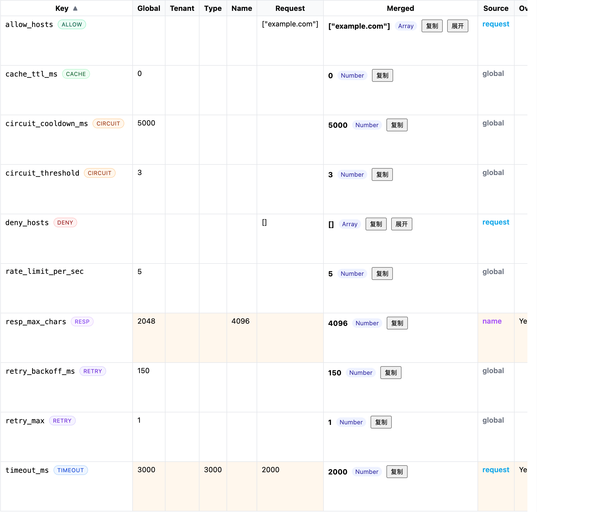

## 导出任务持久化（Redis，可选）

- 系统会自动检测 Redis；可用时优先使用 Redis 持久化任务（状态、进度、结果文件路径），服务重启后仍可查询/下载；不可用时回退到内存。
- 配置示例（.env 或环境变量）：
  ```bash
  export REDIS_HOST=redis
  export REDIS_PORT=6379
  ```
- 验证建议：
  1) 启动导出任务，记录 task_id。
  2) 重启 API 容器/进程。
  3) 使用相同 task_id 调用 `/collections/export/status` 与 `/collections/export/download_by_task`。

## 取消未生效的排查

- 小数据集极易在你发起取消前完成，建议：
  - 提高 `delay_ms_per_point`（如 2000ms）。
  - 或导入更多数据点后再测试取消。
- 指标查看：
  ```bash
  curl -s http://localhost:8000/metrics | egrep 'export_status_total{.*(succeeded|failed|cancelled)'
  ```
# AI Support System

本项目为本地 AI 客服系统（FastAPI + Qdrant + Postgres + Redis + Ollama）。

## 快速开始

1. 复制环境变量模板

```bash
cp configs/env.example .env
```

2. 启动服务（首次会自动构建镜像并拉取依赖）

```bash
docker compose up -d --build
```

3. 健康检查

- API: http://localhost:8000/health
- Qdrant: http://localhost:6333/readyz
- Ollama: http://localhost:11434/api/tags

4. 查看日志

```bash
docker compose logs -f api
```

5. 停止并清理

```bash
docker compose down
```

## 目录结构

- src/app/main.py: FastAPI 入口，提供 /health
- infra/Dockerfile.api: API 服务镜像构建文件
- docker-compose.yml: 容器编排（api、db、redis、qdrant、ollama）
- configs/env.example: 环境变量模板
- requirements.txt: Python 依赖

## 开发提示
- 默认映射本地 `src/` 到容器内 `/app/src`，支持热重载（--reload）。

### Python 版本与类型注解规范（3.9 兼容）

- 运行环境目标为 Python 3.9。
- 禁止使用 Python 3.10+ 的注解新语法（PEP 604 等），例如：`str | None`、`list[str]`。
- 请使用 `typing` 中的兼容写法：
  - `Optional[str]`（替代 `str | None`）
  - `Union[str, int]`（替代 `str | int`）
  - `List[str]`、`Dict[str, Any]` 等（替代内置泛型 `list[str]`、`dict[str, Any]`）
- 已修复的文件（示例）：`src/app/clients/ollama.py`、`src/app/clients/qdrant.py`、`src/app/core/tool_executor.py`、`src/app/core/errors.py`。

### 工具网关的 Prometheus 指标（tools_*）

工具执行器位于 `src/app/core/tool_executor.py`，统一注册并打点以下指标，暴露在 `GET /metrics`（参见 `src/app/routers/metrics.py`）。

- 指标清单与含义：
  - `tools_requests_total{tenant,tool_type,tool_name}`：工具请求总数。
  - `tools_errors_total{tenant,tool_type,tool_name,reason}`：错误总数；`reason` 取值如 `exec_failure` 等。
  - `tools_rate_limited_total{tenant,tool_type,tool_name}`：限流触发次数（返回 429）。
  - `tools_circuit_open_total{tenant,tool_type,tool_name}`：熔断触发次数。
  - `tools_cache_hit_total{tenant,tool_type,tool_name}`：进程内缓存命中次数。
  - `tools_retries_total{tenant,tool_type,tool_name}`：重试累计次数。
  - `tools_request_latency_seconds{tenant,tool_type,tool_name}`：请求耗时直方图（含 `_bucket/_count/_sum`）。
- 常见标签说明：
  - `tenant`：调用方/租户标识（来自 `tenant_id`）。
  - `tool_type`：工具类型（如 `http_get`、`http_post`）。
  - `tool_name`：工具名称（自定义字符串）。
- 示例查看：
  ```bash
  curl -s http://localhost:8000/metrics | grep -E '^(# (HELP|TYPE) tools_|tools_)' | head -n 80
  ```
- 示例 PromQL：
  - 最近 5 分钟错误次数（按原因）：
    ```promql
    sum by (reason,tool_type,tool_name) (increase(tools_errors_total[5m]))
    ```
  - p95 工具请求耗时：
    ```promql
    histogram_quantile(0.95, sum by (le) (rate(tools_request_latency_seconds_bucket[5m])))
    ```

#### 安全策略：HTTP 主机白名单/黑名单

- 为了降低外呼风险，HTTP 工具支持在 `options` 中传入主机白名单/黑名单：
  - `allow_hosts`: 数组，精确匹配主机名（不含协议/端口）。若提供，则目标主机必须在该列表中，否则 403。
  - `deny_hosts`: 数组，精确匹配主机名。若提供且命中，则直接 403。
- 校验位置：执行器校验阶段，路径 `src/app/core/tool_executor.py` 的 `_check_host_policy()`。
- 示例：
  ```json
  {
    "tenant_id": "default",
    "tool_type": "http_get",
    "tool_name": "simple",
    "params": {"url": "https://example.com/path"},
    "options": {"allow_hosts": ["example.com"], "resp_max_chars": 1024}
  }
  ```
  ```json
  {
    "tenant_id": "default",
    "tool_type": "http_get",
    "tool_name": "simple",
    "params": {"url": "https://blocked.example/path"},
    "options": {"deny_hosts": ["blocked.example"]}
  }
  ```

#### 指标样例输出

以下为 `GET /metrics` 中与工具相关的样例片段（仅示例，数值随运行变化）：

```text
# HELP tools_requests_total Total tool requests
# TYPE tools_requests_total counter
tools_requests_total{tenant="t1",tool_type="http_get",tool_name="simple"} 3

# HELP tools_errors_total Total tool errors
# TYPE tools_errors_total counter
tools_errors_total{tenant="t1",tool_type="http_get",tool_name="simple",reason="exec_failure"} 1

# HELP tools_rate_limited_total Total rate limited
# TYPE tools_rate_limited_total counter
tools_rate_limited_total{tenant="t1",tool_type="http_get",tool_name="rl"} 5

# HELP tools_circuit_open_total Total circuit open events
# TYPE tools_circuit_open_total counter
tools_circuit_open_total{tenant="t1",tool_type="http_get",tool_name="cb"} 2

# HELP tools_cache_hit_total Total cache hits
# TYPE tools_cache_hit_total counter
tools_cache_hit_total{tenant="t1",tool_type="http_get",tool_name="cache_demo"} 1

# HELP tools_retries_total Total retries
# TYPE tools_retries_total counter
tools_retries_total{tenant="t1",tool_type="http_get",tool_name="cb"} 4

# HELP tools_request_latency_seconds Tool request latency
# TYPE tools_request_latency_seconds histogram
tools_request_latency_seconds_bucket{tenant="t1",tool_type="http_get",tool_name="simple",le="0.05"} 2
tools_request_latency_seconds_bucket{tenant="t1",tool_type="http_get",tool_name="simple",le="0.1"} 3
tools_request_latency_seconds_bucket{tenant="t1",tool_type="http_get",tool_name="simple",le="+Inf"} 3
tools_request_latency_seconds_count{tenant="t1",tool_type="http_get",tool_name="simple"} 3
tools_request_latency_seconds_sum{tenant="t1",tool_type="http_get",tool_name="simple"} 0.21
```

#### 常见故障定位手册（tools_*）

- 【限流 429】
  - 现象：接口返回 429；`tools_rate_limited_total` 递增。
  - 排查：
    - 查看阈值：请求 `options.rate_limit_per_sec`；或按租户策略的合并逻辑。
    - 指标：`increase(tools_rate_limited_total[5m])`；访问日志内 `status_code=429`。
    - 日志事件：`tools_request`（含 `tenant/tool_type/tool_name`）。

- 【熔断开启】
  - 现象：快速失败；`tools_circuit_open_total` 递增。
  - 排查：
    - 查看 `options.circuit_threshold/circuit_cooldown_ms` 和近期开关次数。
    - 指标：`increase(tools_circuit_open_total[15m])`、`tools_errors_total{reason="exec_failure"}`。
    - 日志事件：`tools_circuit_open`、`tools_request`；关注 `request_id` 关联前后请求。

- 【缓存命中异常】
  - 现象：期望命中/未命中不符；`from_cache` 标志与 `tools_cache_hit_total` 不一致。
  - 排查：
    - 确认稳定键构成：`tenant_id + tool_type + tool_name + 标准化params`。
    - 指标：`increase(tools_cache_hit_total[10m])`；响应 JSON `from_cache` 字段。
    - 可能原因：`params` 字段顺序不同或不一致导致键不同。

- 【重试次数异常】
  - 现象：延迟升高；`tools_retries_total` 递增明显。
  - 排查：
    - 查看 `options.retry_max/retry_backoff_ms` 与目标端可用性。
    - 指标：`rate(tools_retries_total[5m])`、配合 `tools_request_latency_seconds_*` 观察耗时。
    - 日志事件：`tools_retry`，包含当前重试序号与回退毫秒。

- 【执行失败 exec_failure】
  - 现象：返回错误；`tools_errors_total{reason="exec_failure"}` 递增。
  - 排查：
    - 查看路由或执行函数异常堆栈（访问日志/应用日志）。
    - 指标：`increase(tools_errors_total{reason="exec_failure"}[5m])`。
    - 结合 `request_id` 关联同一请求链路，定位上游参数或目标地址问题。


### 本地开发与测试

若不使用 Docker 进行本地调试，可直接运行 FastAPI 与测试：

```bash
# 1) 创建并激活虚拟环境（Python 3.9）
python3.9 -m venv .venv
source .venv/bin/activate

# 2) 安装依赖
pip install -U pip
pip install -r requirements.txt

# 3) 运行测试
pytest -q

# 4) 启动服务（开发模式）
uvicorn src.app.main:app --reload --host 0.0.0.0 --port 8000
```

## API 速览

- 健康检查：`GET /health`
- 聊天：`POST /chat`
  - 请求示例：
    ```bash
    curl -s http://localhost:8000/chat -H 'Content-Type: application/json' \
      -d '{"prompt":"你好，做个自我介绍","model":"llama3"}' | jq .
    ```
 
 - 工具网关：`POST /api/v1/tools/invoke`
   - 字段说明：
     - `tenant_id`：租户/调用方标识，用于限流与指标标签。
     - `tool_type`：`http_get` | `http_post`。
     - `tool_name`：工具名称（自定义字符串，用于指标与限流键）。
     - `params`：
       - `http_get`：`{url: string, headers?: object}`
       - `http_post`：`{url: string, content_type?: string, body?: string|object, headers?: object}`
     - `options`：
       - `timeout_ms`：整体超时（默认 5000）。
       - `retry_max` / `retry_backoff_ms`：重试次数与线性退避（默认 0/200）。
       - `cache_ttl_ms`：进程内缓存 TTL（默认 0=关闭）。
       - `rate_limit_per_sec`：固定窗口限流阈值（默认 10）。
       - `circuit_threshold` / `circuit_cooldown_ms`：熔断阈值与冷却时间（默认 5/30000）。
       - `resp_max_chars`：响应体截断长度（默认 2000）。
   - 示例：
     ```bash
     # 1) http_get
     curl -s http://localhost:8000/api/v1/tools/invoke \
       -H 'Content-Type: application/json' \
       -d '{
         "tenant_id":"t1",
         "tool_type":"http_get",
         "tool_name":"simple",
         "params":{"url":"https://example.com"},
         "options":{"timeout_ms":1500}
       }' | jq .

     # 2) http_post - application/json
     curl -s http://localhost:8000/api/v1/tools/invoke \
       -H 'Content-Type: application/json' \
       -d '{
         "tenant_id":"t1",
         "tool_type":"http_post",
         "tool_name":"post_json",
         "params":{"url":"https://httpbin.org/post","body":{"a":1}},
         "options":{"timeout_ms":2000}
       }' | jq .

     # 3) http_post - text/plain
     curl -s http://localhost:8000/api/v1/tools/invoke \
       -H 'Content-Type: application/json' \
       -d '{
         "tenant_id":"t1",
         "tool_type":"http_post",
         "tool_name":"post_text",
         "params":{"url":"https://httpbin.org/post","content_type":"text/plain","body":"hello"},
         "options":{"timeout_ms":2000}
       }' | jq .

     # 4) 缓存演示（第二次应 from_cache=true）
     payload='{"tenant_id":"t1","tool_type":"http_get","tool_name":"cache_demo","params":{"url":"https://example.com"},"options":{"cache_ttl_ms":60000}}'
     curl -s http://localhost:8000/api/v1/tools/invoke -H 'Content-Type: application/json' -d "$payload" >/dev/null
     curl -s http://localhost:8000/api/v1/tools/invoke -H 'Content-Type: application/json' -d "$payload" | jq .

     # 5) 限流演示（快速并发触发 429）
     for i in {1..12}; do \
       curl -s -o /dev/null -w "%{http_code} " http://localhost:8000/api/v1/tools/invoke \
         -H 'Content-Type: application/json' \
         -d '{"tenant_id":"t1","tool_type":"http_get","tool_name":"rl","params":{"url":"https://example.com"},"options":{"rate_limit_per_sec":5}}' & done; wait; echo

     # 6) 重试/熔断（示例：指向不可达主机以观察重试与熔断，注意：会较慢）
     curl -s -o /dev/null -w "%{http_code}\n" http://localhost:8000/api/v1/tools/invoke \
       -H 'Content-Type: application/json' \
       -d '{
         "tenant_id":"t1",
         "tool_type":"http_get",
         "tool_name":"cb",
         "params":{"url":"http://10.255.255.1/timeout"},
         "options":{"timeout_ms":500,"retry_max":2,"retry_backoff_ms":200,"circuit_threshold":2,"circuit_cooldown_ms":5000}
       }'
     ```

     ```bash
     curl -s http://localhost:8000/metrics | grep -E '^(# (HELP|TYPE) tools_|tools_)' | head -n 80
     # 关注：
     # tools_requests_total / tools_errors_total / tools_rate_limited_total / tools_circuit_open_total / tools_cache_hit_total / tools_retries_total
     # tools_request_latency_seconds_bucket|count|sum
     ```
   - 说明：
     - 限流/熔断/缓存/singleflight 的稳定键包含：`tenant_id`、`tool_type`、`tool_name`、标准化后的 `params`。
     - 结构化日志会记录 `event`（如 `tools_request`/`tools_cache_hit`/`tools_retry`/`tools_circuit_open` 等）与 `request_id`，便于排查与关联。

#### 策略文件格式（tools_policies.json）

- 位置：`configs/tools_policies.json`（可选）。`src/app/routers/tools.py` 会每 15 秒热加载并缓存。
- 合并优先级（低 → 高；后者覆盖前者）：
  1) 全局默认：`default.options`
  2) 指定租户节点：`tenants[tenant_id].options`
  3) 指定租户下按工具类型：`tenants[tenant_id].tools[tool_type].options`
  4) 指定租户下按工具名称：`tenants[tenant_id].tools[tool_type].names[tool_name].options`
  5) 请求体内的 `options`（最终覆盖）
- 允许覆盖的典型键：`timeout_ms`、`retry_max`、`retry_backoff_ms`、`cache_ttl_ms`、`rate_limit_per_sec`、`circuit_threshold`、`circuit_cooldown_ms`、`resp_max_chars`、`allow_hosts`、`deny_hosts`、以及 DB 查询相关 `max_rows`。
- 示例（与当前实现一致）：
  ```json
  {
    "default": {
      "options": {
        "timeout_ms": 3000,
        "rate_limit_per_sec": 5,
        "circuit_threshold": 3,
        "circuit_cooldown_ms": 5000,
        "retry_max": 1,
        "retry_backoff_ms": 150,
        "cache_ttl_ms": 0,
        "resp_max_chars": 2048
      }
    },
    "tenants": {
      "default": {
        "options": {},
        "tools": {
          "http_post": {
            "options": { "timeout_ms": 5000 },
            "names": {
              "simple": { "options": {} }
            }
          },
          "http_get": {
            "options": { "timeout_ms": 3000 },
            "names": {
              "simple": { "options": { "resp_max_chars": 4096, "allow_hosts": ["example.com"] } }
            }
          },
          "db_query": {
            "options": { "timeout_ms": 3000, "max_rows": 1000 },
            "names": {
              "template": { "options": {} }
            }
          }
        }
      }
    }
  }
  ```
  - 以上示例展示了在“租户-工具名”层为 `http_get.simple` 配置 `allow_hosts`，仅允许访问 `example.com`。
  - 你也可以在更高层（如 `tenants.default.tools.http_get.options`）配置 `deny_hosts`，并在名称层按需覆盖：
    ```json
    {
      "tenants": {
        "default": {
          "tools": {
            "http_get": {
              "options": { "deny_hosts": ["blocked.example"] },
              "names": {
                "simple": { "options": { "allow_hosts": ["example.com"] } }
              }
            }
          }
        }
      }
    }
    ```
- 说明：若未提供 `tenant_id`，路由会使用 `_anon_` 作为标签；你可以在策略中为具体租户 ID 添加更细粒度的阈值或限制。
- DB 查询网关在执行器侧还会执行只读校验与 LIMIT 包裹，详见 `src/app/core/tool_executor.py` 与 `src/app/routers/db.py`。

#### 最小调用示例（/api/v1/tools/invoke）

- 请求模型：`ToolInvokeRequest`
  - 字段：`tenant_id?`、`tool_type`、`tool_name`、`params`、`options`
- 响应模型：`ToolInvokeResponse`
  - 字段：`request_id`、`tool_type`、`tool_name`、`result`

#### 策略合并预览（/api/v1/tools/preview）

- 用途：仅返回合并后的执行选项，不实际执行工具调用。便于前端/用户调试策略层级覆盖效果。
- 请求与响应示例：

  请求
  ```bash
  curl -sS -X POST -H 'Content-Type: application/json' \
    --data '{
      "tenant_id": "default",
      "tool_type": "http_get",
      "tool_name": "simple",
      "params": {"url": "https://example.com"},
      "options": {"timeout_ms": 1500, "allow_hosts": ["example.com"]}
    }' \
    http://localhost:8000/api/v1/tools/preview
  ```

  响应
  ```json
  {
    "tenant_id": "default",
    "tool_type": "http_get",
    "tool_name": "simple",
    "merged_options": {
      "timeout_ms": 1500,
      "rate_limit_per_sec": 5,
      "circuit_threshold": 3,
      "circuit_cooldown_ms": 5000,
      "retry_max": 1,
      "retry_backoff_ms": 150,
      "cache_ttl_ms": 0,
      "resp_max_chars": 2048,
      "allow_hosts": ["example.com"]
    },
    "layers": {
      "global": { "rate_limit_per_sec": 5, "retry_max": 1, "retry_backoff_ms": 150, "resp_max_chars": 2048, "cache_ttl_ms": 0, "circuit_threshold": 3, "circuit_cooldown_ms": 5000 },
      "tenant": { },
      "type": { },
      "name": { },
      "request": { "timeout_ms": 1500, "allow_hosts": ["example.com"] },
      "merged": { "timeout_ms": 1500, "rate_limit_per_sec": 5, "circuit_threshold": 3, "circuit_cooldown_ms": 5000, "retry_max": 1, "retry_backoff_ms": 150, "cache_ttl_ms": 0, "resp_max_chars": 2048, "allow_hosts": ["example.com"] }
    }
  }
  ```

- 说明：合并顺序为 全局默认 → 租户默认 → 工具类型 → 工具名称 → 请求级 `options`。

- layers 字段：
  - `global`：全局默认层的 options 快照
  - `tenant`：租户默认层
  - `type`：租户下该工具类型层
  - `name`：租户下该工具具体名称层
  - `request`：本次请求传入的 `options`
  - `merged`：以上层级按顺序覆盖后的最终结果（与 `merged_options` 一致）

- 前端可视化建议：
  - 在 `/tools` 页面展示 `merged_options` 与 `layers`，对每个键标注来源层（如 source=tenant），标识是否覆盖了更早层（overrode earlier layer）。
  - 业务常见关注键：`allow_hosts`、`deny_hosts`、`timeout_ms`、`rate_limit_per_sec`、`retry_*`、`circuit_*`、`cache_ttl_ms`、`resp_max_chars`。

#### 前端工具调试面板（/tools）

- 功能概览：
  - 输入 `tenant_id`、`tool_type`、`tool_name`、`params`、`options`
  - 请求预览与 cURL 预览，一键复制
  - 结果展示、响应头、状态码与耗时
  - 合并策略预览：调用 `/api/v1/tools/preview` 展示 `merged_options`
  - 按类型模板：根据 `tool_type` 快速填充 GET/POST 模板
  - 调用历史：最近 20 次，支持一键恢复


- cURL 示例（HTTP GET，依赖策略合并响应截断到 4096 字符）：
  ```bash
  curl -s -X POST http://localhost:8000/api/v1/tools/invoke \
    -H 'Content-Type: application/json' \

- 观测联动（可选配置）：
  - 在页面中“观测链接”折叠区配置：
  - Prometheus 基础 URL（例如 `http://localhost:9090`）与查询模板
  - 日志系统基础 URL（例如 Loki/Kibana 网关地址）与查询模板
  - 查询模板占位符：`$tenant`、`$type`、`$name`、`$key`（分别对应 `tenant_id`、`tool_type`、`tool_name`、策略键名）
  - 表格“Obs”列：
  - 点击“指标”会在新窗口打开 Prometheus 查询URL
  - 点击“日志”会在新窗口打开日志检索URL
  - Prometheus 兼容性：若基础 URL 以 `/graph` 风格为主，前端会自动拼接 `g0.expr=`；否则使用 `query=`
  - 观测配置持久化与重置：
    - 前端会将上述观测配置保存在浏览器 `localStorage`（键：`toolsObsConf`），刷新页面后自动恢复。
    - 如需清空，使用“重置观测配置”按钮（位于“观测链接”折叠区底部），将恢复默认模板并清除本地存储。
  - 模板预览与测试打开：
    - 在“测试键名”中输入如 `timeout_ms`，下方会实时展示 PromQL 与日志查询的模板替换预览。
    - 点击“测试打开指标/测试打开日志”，将使用当前配置与测试键名在新标签页打开对应查询，便于快速验证。
  - 环境默认值（可选）：
    - 支持通过 Vite 环境变量为观测配置预填默认值（在无 localStorage 时加载，且“重置观测配置”时也会优先恢复为这些默认值）：
      - `VITE_OBS_PROM_BASE`
      - `VITE_OBS_PROM_QUERY_TPL`
      - `VITE_OBS_LOGS_BASE`
      - `VITE_OBS_LOGS_QUERY_TPL`
    - 使用方式：在 `.env.local` 或构建环境中设置上述变量，例如：
      - `VITE_OBS_PROM_BASE=http://localhost:9090/graph`
      - `VITE_OBS_LOGS_BASE=https://logs.example.com/search`
  - 导入/导出配置：
    - “导出配置”会将当前观测配置下载为 `toolsObsConf.json`，便于共享或备份。
    - “导入配置”支持选择上述 JSON 文件进行恢复；导入后会立即写入 localStorage 并更新表单。
    - 表单校验与提示：
      - 基地址需以 `http/https` 开头，非法时会在输入框旁显示红色提示，并禁用测试按钮。
      - 测试按钮在被禁用时，会通过 `title` 提示禁用原因；点击测试若地址非法会弹出警告。
      - 导入 JSON 解析失败或键缺失时，保持现状并提示错误。

    - 更多判定与样例：参见 `docs/tools_screenshots.md` 中的“启用态（文字说明）”及导入样例 `docs/assets/toolsObsConf.json`。

- 操作步骤建议：
  1) 填写 `tenant_id`、`tool_type`、`tool_name`、`params`、`options`；或使用“按类型模板”快速填充
  2) 点击“预览合并策略”，在下方查看 `merged_options` 与“策略层级 Diff 表”
  3) 使用“键名过滤/预设筛选/子键排序表达式”快速定位关注项
  4) 如需跳转指标/日志，先在“观测链接”中配置基础URL与模板，再点击对应行“Obs”列的按钮
  5) 若数据量大且滚动卡顿，启用“虚拟滚动”并调整高度；需要导出则使用 CSV 按钮

- 性能与可用性说明：
  - 虚拟滚动与分页互斥；仅在其一启用时生效

- 截图/动图（示例占位）：
  - 如下图片路径需先按 `docs/tools_screenshots.md` 指南采集素材保存至 `docs/assets/` 后即可显示。
  - 面板总览：
  - 观测链接表单：
  - 模板预览与测试打开：
  - 导入/导出配置：
  - URL 校验与提示：
  - 行级 Obs 跳转：
  - 动图演示（可选）：
    - 若未生成 GIF，可忽略此项；或直接使用已准备的静态帧序列目录 `docs/assets/gif_frames/`（frame01.png ~ frame06.png）进行阅读或后续合成。
  - 当未配置观测基础 URL 时，“Obs”列按钮将禁用
  - 子键排序仅在按 Merged 列排序时生效；表达式解析失败时自动降级
  - 已去除重复的“启用虚拟滚动”标签，保持 UI 简洁

- 模板示例（可根据你的环境调整）：
  - Prometheus：`sum by (tool_type,tool_name) (increase(tools_errors_total{tenant="$tenant",tool_type="$type",tool_name="$name"}[5m]))`
  - 日志：`{tenant="$tenant",tool_type="$type",tool_name="$name"} |= "$key"`

> 提示：若你的监控/日志系统有固定空间或组织参数，可直接在“基础 URL”中带上预置的查询面板路径，只需在模板里替换上述占位符即可。

### 模板版本与审计

- 列出模板与版本：`GET /api/v1/db/templates`
- 最近审计日志（环形缓冲区内存）：`GET /api/v1/db/audit`
- 查询接口支持 `template_version`，缺省时自动选择该模板最新版本。


### 架构与核心模块（执行器）

- 模块位置：`src/app/core/tool_executor.py`
- 职责：统一实现网关的可靠性与执行流程，向上暴露单一方法 `executor.execute(tenant_id, tool_type, tool_name, params, options)`。
- 内置能力：
  - 限流（固定窗口，每秒阈值，可配置 `options.rate_limit_per_sec`）
  - singleflight（并发相同稳定键的请求合并）
  - 熔断（失败计数与冷却时间，`options.circuit_threshold`/`options.circuit_cooldown_ms`）
  - 重试（线性退避，`options.retry_max`/`options.retry_backoff_ms`）
  - 进程内缓存（`options.cache_ttl_ms`，命中返回 `from_cache=true`）
  - 真实 HTTP 调用（`http_get`/`http_post`，含响应体截断 `options.resp_max_chars`）
  - 指标（Prometheus）与脱敏日志（如 `token`/`authorization`/`cookie` 等字段）
- 稳定键构成：`tenant_id` + `tool_type` + `tool_name` + 标准化 `params` 的哈希；用于限流、singleflight、缓存与熔断的键空间。
- 指标汇总：在执行器内集中注册 `tools_*` 指标，避免在路由层重复注册。
- 路由层精简：`src/app/routers/tools.py` 仅做参数承接与调用执行器，返回标准响应模型。

#### 扩展新工具类型

1. 在 `ToolExecutor._validate()` 中添加工具类型与名称的校验与标准化逻辑。
2. 在 `ToolExecutor.execute()` 中按 `tool_type` 分支调用对应执行函数（或新增 `_do_xxx()`）。
3. 确认返回结构包含：`message`、`normalized`、可选 `http`/`body` 字段。
4. 如需新增指标，请在执行器内统一注册并打点，保持标签一致性：`tool_type`、`tool_name`、`tenant`。

#### 策略配置化（建议）

- 可将租户/工具维度的阈值（如限流、熔断）外置为配置，并在调用 `execute()` 前合并到 `options`。
- 示例：根据 `tenant_id`/`tool_type`/`tool_name` 从配置中心加载策略，覆盖默认 `options`。

- __后台导出（大数据量推荐）__
  ```bash
  # 1) 启动后台导出任务
  task_id=$(curl -s -X POST http://localhost:8000/collections/export/start \
    -H 'Content-Type: application/json' \
    -d '{"collection":"demo","with_vectors":true,"with_payload":true}' | jq -r .task_id)
{{ ... }}
  echo $task_id

  # 2) 轮询任务状态（running/succeeded/failed）
  curl -s "http://localhost:8000/collections/export/status?task_id=$task_id" | jq .

  # 3) 任务成功后下载结果文件
  curl -L "http://localhost:8000/collections/export/download_by_task?task_id=$task_id" -o demo_export.jsonl
  head -n 3 demo_export.jsonl
  ```
  注意：当前为“内存任务表”实现，API 重启后任务状态会丢失；如需持久化，请接入存储（如 Redis/DB）。

- __后台导出：取消任务与自动清理__
  ```bash
  # 取消导出任务
  curl -s -X DELETE "http://localhost:8000/collections/export/task?task_id=$task_id" | jq .

  # 导出指标（Prometheus）
  curl -s http://localhost:8000/metrics | egrep 'export_duration_seconds|export_rows_total|export_status_total' | head
  ```
  说明：任务完成后 1 小时（可配置）后台清理器会清理过期任务与临时文件。

- __可选：长时任务与 gzip 压缩__
  ```bash
  # 通过节流参数（每条延迟 50ms）使任务可取消
  task_id=$(curl -s -X POST http://localhost:8000/collections/export/start \
    -H 'Content-Type: application/json' \
    -d '{"collection":"demo","with_vectors":true,"with_payload":true,"delay_ms_per_point":50}' | jq -r .task_id)
  # 立即取消
  curl -s -X DELETE "http://localhost:8000/collections/export/task?task_id=$task_id" | jq .

  # 生成 gzip 压缩文件（.jsonl.gz）
  task_id=$(curl -s -X POST http://localhost:8000/collections/export/start \
    -H 'Content-Type: application/json' \
    -d '{"collection":"demo","with_vectors":true,"with_payload":true,"with_gzip":true}' | jq -r .task_id)
  curl -L "http://localhost:8000/collections/export/download_by_task?task_id=$task_id" -o demo_export.jsonl.gz
  ls -lh demo_export.jsonl.gz
  ```

- RAG 评估：`POST /chat/rag_eval`
  - 批量查询统计命中率与平均分，可选导出 CSV。
  - JSON 示例：
    ```bash
    curl -s -X POST http://localhost:8000/chat/rag_eval \
      -H 'Content-Type: application/json' \
      -d '{"queries":["如何登录？","忘记密码怎么办？","发票如何开具？"],"collection":"demo","top_k":3}' | jq .
    ```
  - CSV 导出：
    ```bash
    curl -L -X POST "http://localhost:8000/chat/rag_eval" \
      -H 'Content-Type: application/json' \
      -d '{"queries":["如何登录？","忘记密码怎么办？","发票如何开具？"],"collection":"demo","top_k":3,"export":"csv"}' \
      -o rag_eval.csv
    head -n 10 rag_eval.csv
    ```

- __浏览器下载与 gzip 压缩__
  ```bash
  # 浏览器直接下载（非压缩）
  # http://localhost:8000/collections/export/download?collection=demo

  # curl 下载（非压缩）
  curl -L "http://localhost:8000/collections/export/download?collection=demo" -o demo.jsonl

  # curl 下载（gzip 压缩）
  curl -L "http://localhost:8000/collections/export/download?collection=demo&gzip=true" -o demo.jsonl.gz
  gzip -cd demo.jsonl.gz | sed -n '1,3p'

  # 过滤 + gzip（filters 为 URL 编码的 JSON 字符串）
  curl -L "http://localhost:8000/collections/export/download?collection=demo&filters=%7B%22tag%22%3A%22faq%22%7D&gzip=true" -o demo_faq.jsonl.gz
  gzip -cd demo_faq.jsonl.gz | wc -l
  ```
  可选参数：
  - `delay_ms_per_point`：每条输出后的延迟（毫秒），用于节流或测试长时下载。
  - 指标（Prometheus）：
    - 下载耗时直方图：`download_duration_seconds{collection,gzip}`
    - 下载字节计数器：`download_bytes_total{collection,gzip}`
    - 下载行数计数器：`download_rows_total{collection}`
  示例验证：
  ```bash
  # 触发一次普通与 gzip 下载
  curl -s -LOJ "http://localhost:8000/collections/export/download?collection=demo&with_vectors=true&with_payload=true"
  curl -s -LOJ "http://localhost:8000/collections/export/download?collection=demo&with_vectors=true&with_payload=true&gzip=true"

  # 查看指标是否增长
  curl -s http://localhost:8000/metrics | egrep 'download_duration_seconds|download_bytes_total|download_rows_total' | head -n 50
  ```
- 向量：`POST /embedding/embed`（仅生成向量）
  - 请求示例：
    ```bash
    curl -s http://localhost:8000/embedding/embed -H 'Content-Type: application/json' \
      -d '{"texts":["青山不改，绿水长流"],"model":"llama3"}' | jq .
    ```
- 向量入库：`POST /embedding/upsert`（写入 Qdrant）
  - 请求示例：
    ```bash
    curl -s http://localhost:8000/embedding/upsert -H 'Content-Type: application/json' \
      -d '{"texts":["第一条文档","第二条文档"],"collection":"demo"}' | jq .
    ```

  - UUID 覆盖 upsert 与 422 排错
    - 如需使用字符串 UUID 覆盖已有点位，请传入 `ids` 为字符串数组（后端已支持 `int` 与 `str` 两种 id 类型）：
      ```bash
      curl -s http://localhost:8000/embedding/upsert -H 'Content-Type: application/json' \
        -d '{
          "collection":"demo",
          "ids":["09d19e8f-4be6-43ce-880e-ee8266bac0ee"],
          "texts":["可通过脚本导入 demo 数据，也可从 jsonl 导入 FAQ"],
          "payloads":[{"text":"可通过脚本导入 demo 数据，也可从 jsonl 导入 FAQ"}]
        }' | jq .
      ```
    - 若出现 422（`ids[0]` 需要整数），说明后端版本较旧或类型未更新。请确认 `src/app/routers/embedding.py` 中：
      - `UpsertRequest.ids: Optional[List[Union[int, str]]] = None`
      - 修改后重启 API：`docker compose up -d --build api`。
    - 覆盖完成后，可用以下命令复查 `payload.text` 与 RAG 预检：
      ```bash
      # Search 复查
      curl -s http://localhost:8000/embedding/search -H 'Content-Type: application/json' \
        -d '{"query":"FAQ","collection":"demo","top_k":3}' | jq .

      # RAG 预检复查
      curl -s http://localhost:8000/api/v1/rag/preflight -H 'Content-Type: application/json' \
        -d '{"query":"系统如何导入FAQ？","collection":"demo","top_k":3}' | jq .
      ```

  - 批量 re-upsert 与排错
    - 使用 Python 脚本（推荐，支持 UUID 与自动补齐 payload.text）：
      ```bash
      # 建议在虚拟环境中执行（PEP 668 环境）
      python3 -m venv .venv
      source .venv/bin/activate
      python -m pip install -r requirements.txt

      # 批量将 JSONL 写入向量库（需包含 text 字段，或按你的结构转换生成 text）
      python scripts/batch_reupsert.py \
        --input demo.jsonl \
        --collection demo_768 \
        --base-url http://127.0.0.1:8000 \
        --batch-size 64
      ```
      - 输入 JSONL 每行形如：
        ```json
        {"id":"可选-整型或UUID","text":"一行文本","payload":{"text":"一行文本","tag":"faq"}}
        ```
        - 若未提供 `payload`，脚本会自动补 `{ "text": 原文 }`。
        - 若未提供 `id`，由后端/Qdrant 自动生成。
      - 常见错误：
        - `ModuleNotFoundError: No module named 'httpx'`：请先创建虚拟环境并安装 `requirements.txt`。
        - `line N missing non-empty 'text'`：你的 JSONL 行无 `text` 字段或为空；请先用 jq/脚本从 `question/query/prompt` 等字段映射生成 `text`。
          - 示例转换（若原文件含 `question` 字段）：
            ```bash
            jq -c '{id: .id, text: (.text // .question // .query // .prompt), payload: (.payload // (if (.text // .question // .query // .prompt) then {text:(.text // .question // .query // .prompt)} else null end))} | select(.text != null and (.text|tostring|length) > 0)'
            ```

    - 使用 Shell 脚本（便捷初始化 Demo 集合，内置回退与预热）：
      ```bash
      # 变量：API_BASE / RAG_COLLECTION / RAG_MODEL / SRC_JSONL / BATCH_SIZE / MAX_DOCS / OUT_DIR
      API_BASE=http://127.0.0.1:8000 RAG_COLLECTION=demo_768 bash scripts/prepare_demo_embeddings.sh
      ```
      - 行为说明：
        - 等待 `/-/ready` 与嵌入模型预热（避免冷启动 500）。
        - 优先从 `SRC_JSONL` 提取 `text`；若失败则回退到仓库自带样例；仍失败时使用内置小语料以初始化集合。
        - 结果写入 `artifacts/metrics/embedding_upsert.json`。
      - 常见错误：
        - `jq 未安装`：请先安装 jq。
        - `预热阶段 dim 未解析`：脚本已加固为默认 0，不影响继续执行。

- 向量检索：`POST /embedding/search`
  - 请求示例：
    ```bash
    curl -s http://localhost:8000/embedding/search -H 'Content-Type: application/json' \
      -d '{"query":"第二条","collection":"demo","top_k":3}' | jq .
    ```
- 基于检索增强的对话（RAG）：`POST /chat/rag`
  - 说明：先用 `/embedding/upsert` 将文本写入向量库（默认存入 payload.text），再用问题进行检索增强回答。
  - 请求示例：
    ```bash
    # 1) 入库示例
    curl -s http://localhost:8000/embedding/upsert -H 'Content-Type: application/json' \
      -d '{"texts":["青山不改，绿水长流","春眠不觉晓，处处闻啼鸟","少壮不努力，老大徒伤悲"],"collection":"demo","model":"qwen2.5:7b"}' | jq .

    # 2) RAG 同步回答（JSON）
    curl -s http://localhost:8000/chat/rag -H 'Content-Type: application/json' \
      -d '{"query":"请用一句话概括与春天有关的内容","collection":"demo","top_k":3,"model":"qwen2.5:7b"}' | jq .
    ```
- 基于检索增强的流式对话：`POST /chat/rag_stream`
  - 请求示例（text/plain 实时输出）：
    ```bash
    curl -N -s http://localhost:8000/chat/rag_stream -H 'Content-Type: application/json' \
      -d '{"query":"请用一句话概括与春天有关的内容","collection":"demo","top_k":3,"model":"qwen2.5:7b"}'
    ```
- 如需选择或拉取模型（e.g. `llama3`），待容器启动后执行：

```bash
docker compose exec ollama ollama pull llama3
```

### 按 payload 过滤检索与 RAG（可选）
- 现在 `/embedding/search` 与 `/chat/rag`/`/chat/rag_stream` 支持可选 `filters` 字段，用于按 payload 精确匹配过滤（key=value）。
- 示例：先入库带标签的文档，再按标签过滤检索与 RAG。
```bash
# 入库时自定义 payload（包含标签）
curl -s http://localhost:8000/embedding/upsert -H 'Content-Type: application/json' \
  -d '{"texts":["产品A使用教程","产品B常见问题"],"collection":"demo","model":"qwen2.5:7b","payloads":[{"text":"产品A使用教程","tag":"guide"},{"text":"产品B常见问题","tag":"faq"}]}' | jq .

# 按标签过滤：只检索 tag=faq 的文档
curl -s http://localhost:8000/embedding/search -H 'Content-Type: application/json' \
  -d '{"query":"登录失败","collection":"demo","top_k":3,"filters":{"tag":"faq"}}' | jq .

# RAG 中使用相同过滤
curl -N -s http://localhost:8000/chat/rag_stream -H 'Content-Type: application/json' \
  -d '{"query":"如何解决登录失败","collection":"demo","top_k":3,"model":"qwen2.5:7b","filters":{"tag":"faq"}}'
```

## 许可
MIT

## 配置项说明与调优

可在项目根目录创建 `.env`（或复制 `configs/env.example` 为 `.env` 并按需修改）。主要配置：

- __[API]__
  - `API_PORT`: FastAPI 服务端口（默认 `8000`）。

- __[Postgres]__
  - `POSTGRES_*`: 用户名、密码、数据库、主机、端口。

- __[Redis]__
  - `REDIS_HOST` / `REDIS_PORT`。

- __[Qdrant]__
  - `QDRANT_HOST` / `QDRANT_PORT`。

- __[Ollama]__
  - `OLLAMA_HOST` / `OLLAMA_PORT`：Ollama 服务地址与端口。
  - `OLLAMA_MODEL`：默认模型，已设为 `qwen2.5:7b`。
  - `OLLAMA_KEEP_ALIVE`：连接保活（如 `5m`），减少冷启动。

- __[客户端默认参数]__
  - `GENERATE_TIMEOUT`：生成接口超时（秒，默认 `300`）。
  - `EMBED_TIMEOUT`：向量接口超时（秒，默认 `120`）。
  - `DEFAULT_TOP_K`：未显式传入时检索的默认条数（默认 `5`）。
  - `DEFAULT_NUM_PREDICT`：未显式传入时生成的最大 token 数（默认 `256`）。

- __[并发上限]__
  - `DOWNLOAD_MAX_CONCURRENCY`：下载并发上限（默认 `4`）。
  - `EXPORT_MAX_CONCURRENCY`：后台导出并发上限（默认 `2`）。
  - 说明：`docker-compose.yml` 内为便于本地复现，将两者覆盖为 `1`；生产建议按需提升或移除此覆盖。

- __[日志]__
  - `LOG_LEVEL`：日志级别（`DEBUG`/`INFO`/`WARNING`/`ERROR`，默认 `INFO`）。
  - 日志采用 JSON 结构化输出，定义见 `src/app/core/logging_config.py`。

### 调优建议
- __首字节时间__：增大 `OLLAMA_KEEP_ALIVE`（如 `10m`），可减少冷启动等待；保持 `chat/stream` 或 `stream_raw` 使用以获取更快首字节。
- __长文本生成__：增大 `DEFAULT_NUM_PREDICT` 或在请求 `options` 中指定 `num_predict`。
- __检索范围__：根据数据密度调整 `DEFAULT_TOP_K`，并配合 `filters` 限定范围。
- __超时设置__：对于大模型或复杂问题，适当提升 `GENERATE_TIMEOUT`；向量计算可根据机器性能调整 `EMBED_TIMEOUT`。

## 统一错误返回与请求追踪

系统内置全局异常处理与结构化日志：

- __错误返回格式__（示例）：
  ```json
  {
    "error": "ValidationError",
    "detail": [{"loc":["body","collection"],"msg":"field required","type":"value_error.missing"}],
    "request_id": "a1b2c3..."
  }
  ```
- __请求追踪__：所有响应头包含 `X-Request-Id`，可用于串联客户端日志与服务器日志。
- __耗时统计__：每个请求会记录结构化访问日志，包含 `path`、`method`、`status_code`、`duration_ms`。

对应实现：`src/app/core/middleware.py`、`src/app/core/errors.py` 并在 `src/app/main.py` 注册。

### 结构化日志与链路追踪（export 与 download）

- 日志为 JSON 格式，示例（字段随事件不同略有差异）：
  ```json
  {"level":"INFO","time":"2025-08-19T06:20:10Z","message":"export_start","event":"export_start","task_id":"<id>","collection":"demo","with_vectors":true,"with_payload":true,"with_gzip":false,"delay_ms_per_point":2000,"trace_id":"<request-id>"}
  {"level":"INFO","time":"2025-08-19T06:20:15Z","message":"export_finish","event":"export_finish","status":"cancelled","task_id":"<id>","collection":"demo","written":2,"duration_ms":5004,"trace_id":"<request-id>"}
  {"level":"INFO","time":"2025-08-19T06:21:00Z","message":"download_finish","event":"download_finish","collection":"demo","gzip":true,"rows":8,"bytes":72587,"duration_ms":31,"request_id":"<request-id>"}
  ```
- 链路关联：
  - 网关到 API：通过响应头 `X-Request-Id` 对齐客户端与服务端日志。
  - 请求到后台任务：启动导出时会把当前请求的 `request_id` 作为 `trace_id` 写入任务上下文，后续 `export_*` 日志会携带同一 `trace_id`，便于关联。
  - 下载端点日志会携带 `request_id`，可与访问日志对齐。

### 稳定复现“取消”

- 小数据集下任务完成过快，取消可能不易命中。建议：
  1) 将 `delay_ms_per_point` 调大（如 10000ms）：
     ```bash
     task_id=$(curl -s -X POST http://localhost:8000/collections/export/start \
       -H 'Content-Type: application/json' \
       -d '{"collection":"demo","with_vectors":true,"with_payload":true,"delay_ms_per_point":10000}' | jq -r .task_id)
     echo "$task_id"
     curl -s -X DELETE "http://localhost:8000/collections/export/task?task_id=$task_id" | jq .
     ```
  2) 或者增加集合内的数据量（例如 1000 条），使用较小的延迟（如 500ms）。
  3) 观察指标：
     ```bash
     curl -s http://localhost:8000/metrics | egrep 'export_status_total{.*(succeeded|failed|cancelled)'
     ```

## 集合管理 API 使用示例

- __列出集合__
  ```bash
  curl -s http://localhost:8000/collections | jq .
  ```

- __集合信息__
  ```bash
  curl -s http://localhost:8000/collections/demo | jq .
  ```

- __确保集合存在__（指定维度与距离）
  ```bash
  curl -s http://localhost:8000/collections/ensure -H 'Content-Type: application/json' \
    -d '{"name":"demo","vector_size":3584,"distance":"COSINE"}' | jq .
  ```

- __清空集合__（保留 schema）
  ```bash
  curl -s -X POST http://localhost:8000/collections/demo/clear | jq .
  ```

- __按 ID 删除__
  ```bash
  curl -s -X POST http://localhost:8000/collections/points/delete_by_ids -H 'Content-Type: application/json' \
    -d '{"collection":"demo","ids":["<your-point-id>"]}' | jq .
  ```

- __按过滤删除__（例如删除 tag=faq）
  ```bash
  curl -s -X POST http://localhost:8000/collections/points/delete_by_filter -H 'Content-Type: application/json' \
    -d '{"collection":"demo","filters":{"tag":"faq"}}' | jq .
  ```

- __批量写入文本并自动向量化__（payload 自动包含 `text` 字段）
  ```bash
  # 先确保集合存在（向量维度需与使用的 embeddings 模型一致）
  curl -s http://localhost:8000/collections/ensure -H 'Content-Type: application/json' \
    -d '{"name":"demo","vector_size":3584,"distance":"COSINE"}' | jq .

  # 批量 upsert 文本
  curl -s -X POST http://localhost:8000/collections/points/upsert_texts \
    -H 'Content-Type: application/json' \
    -d '{
      "collection":"demo",
      "texts":["登录失败可能是密码错误。","如忘记密码，请使用找回功能。","系统维护期间登录可能受影响。"],
      "metadatas":[{"tag":"faq"},{"tag":"faq"},{"tag":"notice"}]
    }' | jq .
  ```

## 流式接口（SSE）

系统同时提供 POST 与 GET 两种 SSE 方式：

- __POST SSE：聊天__
  ```bash
  curl -N -s http://localhost:8000/chat/stream_sse -H 'Content-Type: application/json' \
    -d '{"prompt":"介绍一下你自己（20字以内）"}'
  ```

- __POST SSE：RAG__
  ```bash
  curl -N -s http://localhost:8000/chat/rag_stream_sse -H 'Content-Type: application/json' \
    -d '{"query":"如何解决登录失败","collection":"demo","filters":{"tag":"faq"}}'
  ```

- __GET SSE：聊天（更适配浏览器 EventSource）__
  ```bash
  curl -N -s "http://localhost:8000/chat/stream_sse?prompt=%E4%BB%8B%E7%BB%8D%E4%B8%80%E4%B8%8B%E4%BD%A0%E8%87%AA%E5%B7%B1%EF%BC%8820%E5%AD%97%E4%BB%A5%E5%86%85%EF%BC%89"
  ```

- __GET SSE：RAG（filters 以 JSON 字符串传入）__
  ```bash
  curl -N -s "http://localhost:8000/chat/rag_stream_sse?query=%E5%A6%82%E4%BD%95%E8%A7%A3%E5%86%B3%E7%99%BB%E5%BD%95%E5%A4%B1%E8%B4%A5&collection=demo&filters=%7B%22tag%22%3A%22faq%22%7D"
  ```

期望 RAG SSE 输出末尾包含“参考来源”，如：
```
data: 参考来源:
data: - id=... score=0.70 tag=faq title=登录失败可能是密码错误。
data: - id=... score=0.64 tag=faq title=如忘记密码，请使用找回功能。
data: [DONE]
```

## 健康检查与指标

- __健康检查__
  ```bash
  curl -s http://localhost:8000/health | jq .
  ```
  - 简化健康检查：
    ```bash
    curl -s http://localhost:8000/healthz | jq .
    ```
  返回示例：包含 `postgres`、`redis`、`qdrant`、`ollama` 的健康状态和总体状态。

- __云原生探针__
  ```bash
  # 存活探针：不依赖外部服务
  curl -s http://localhost:8000/-/live | jq .

  # 就绪探针：仅检查关键依赖（Qdrant、Ollama）
  curl -s http://localhost:8000/-/ready | jq .
  ```
  Kubernetes 示例：
  ```yaml
  livenessProbe:
    httpGet:
      path: /-/live
      port: 8000
    initialDelaySeconds: 5
    periodSeconds: 10

  readinessProbe:
    httpGet:
      path: /-/ready
      port: 8000
    initialDelaySeconds: 5
    periodSeconds: 10
  ```

- __Prometheus 指标__
  ```bash
  curl -s http://localhost:8000/metrics | head -n 30
  ```
  指标包含 `http_requests_total`、`http_request_duration_seconds` 等。访问接口后数值会递增。
  
  #### 前端健康点灯与悬浮详情
  - 顶栏点灯每 10s 轮询 `GET /api/-/ready`，根据状态展示：ready/degraded/error/checking。
  - 悬停点灯时请求 `GET /api/health` 展示依赖详情（Postgres/Redis/Qdrant/Ollama）。
  - 文案使用 Vue-i18n：`health.overall`、`health.status.*`、`health.services.*`。
  - 代码位置：`frontend/src/App.vue`、`frontend/src/i18n.ts`。
  
  #### RAG 预检软失败与前端提示
  - 端点：`POST /api/v1/rag/preflight`，异常时返回 200 + JSON `{ ok: false, error: "..." }`（软失败），避免前端崩溃。
  - 前端在 `Home.vue` 展示错误提示与“重试”按钮，i18n 键：`preflightErr`、`retry`。
  - 代码位置：`frontend/src/views/Home.vue`、`frontend/src/i18n.ts`。
  
  #### CI 测试与环境变量
  - 端到端最小化断言涵盖：
    - 健康探针：`tests/test_health_and_preflight_ci.py`
    - SSE 流式接口：`tests/test_sse_stream_ci.py`
  - 环境变量：
    - `API_BASE_URL`：测试基准地址（默认 `http://127.0.0.1:8000`；CI 设为 `http://localhost:8000`）。
    - `SKIP_E2E=1`：在无法启动依赖的场景下跳过上述端到端测试。
  
  新增应用级指标（示例查询）：
  - 生成耗时（区分流式与否）：
    ```bash
    curl -s http://localhost:8000/metrics | egrep 'llm_generate_duration_seconds.*model|stream'
    ```
  - 嵌入耗时：
    ```bash
    curl -s http://localhost:8000/metrics | egrep 'embed_duration_seconds'
    ```
  - RAG 检索耗时：
    ```bash
    curl -s http://localhost:8000/metrics | egrep 'rag_retrieval_duration_seconds'
    ```
  - RAG 命中计数（命中率可由 true/false 计数比值获得）：
    ```bash
    curl -s http://localhost:8000/metrics | egrep 'rag_matches_total'
    ```

    #### 运行手册：Smoke / RAG 门禁 / 告警验证

    - 【Smoke（plain + RAG）】
      ```bash
      bash scripts/smoke_ask.sh
      ```

    - 【RAG 门禁（严格样本量可选）】
      ```bash
      # 严格样本量策略示例（min=10 且必须满足）
      GATE_MIN_TOTAL=10 GATE_REQUIRE_MIN_TOTAL=1 \
      RAG_EVAL_QUERIES=demo.jsonl RAG_TOP_K=5 \
      bash scripts/rag_eval_gate.sh
      ```

    - 【触发合成错误（404）并验证指标】
      ```bash
      # 触发 404（不存在的集合）
      curl -sS -o artifacts/metrics/err_rag_eval.json -w "HTTP=%{http_code}\n" \
        -H 'Content-Type: application/json' \
        -d '{"queries":["test"],"collection":"__non_exist__"}' \
        http://localhost:8000/chat/rag_eval

      # 抓取 Prometheus 指标
      curl -sS http://localhost:8000/metrics > artifacts/metrics/metrics_after_404.prom

      # 关注关键序列（示例）
      egrep -n "^http_requests_total\\{" artifacts/metrics/metrics_after_404.prom | head
      egrep -n "^http_request_duration_seconds_count\\{" artifacts/metrics/metrics_after_404.prom | head
      egrep -n "^(rag_|embed_|llm_)" artifacts/metrics/metrics_after_404.prom | head
      ```

    - 【查看 Alertmanager 当前告警】
      ```bash
      curl -sS http://localhost:9093/api/v2/alerts | jq .
      ```

### 并发限制与监控（下载/导出）

- __并发上限环境变量__（可在 `.env` 或容器环境中配置；进程级信号量控制）：
  - `DOWNLOAD_MAX_CONCURRENCY`：下载并发上限（默认 `4`）。
  - `EXPORT_MAX_CONCURRENCY`：后台导出并发上限（默认 `2`）。

- __并发运行指标（Gauge）__：
  - `export_running{collection}`：当前运行中的导出任务数。
  - `download_running{collection,gzip}`：当前进行中的下载请求数。注意 `gzip` 标签值为字符串 `"true"` 或 `"false"`（小写）。

- __其他相关指标__：
  - 下载：`download_duration_seconds{collection,gzip}`、`download_bytes_total{collection,gzip}`、`download_rows_total{collection}`。
  - 导出：`export_duration_seconds{collection}`、`export_rows_total{collection}`、`export_status_total{collection,status}`（status: succeeded|failed|cancelled）。

- __429 行为__：当下载并发槽位已满时，`GET /collections/export/download` 会直接返回 `429`，错误详情为 `"too many concurrent downloads"`。

- __复现 429 与验证指标__：
  ```bash
  # 1) 启动一个长时下载（每条延迟 15s）
  curl -s -LOJ "http://localhost:8000/collections/export/download?collection=demo&with_vectors=true&with_payload=true&delay_ms_per_point=15000" &

  # 2) 立即再发起一个并发下载，请求应返回 429
  curl -s -o /dev/null -w "%{http_code}\n" "http://localhost:8000/collections/export/download?collection=demo&delay_ms_per_point=15000"

  # 3) 查看并发运行指标，应显示为 1（gzip=false）
  curl -s http://localhost:8000/metrics | egrep 'download_running'

  # 4) 查看访问日志与警告（容器内）
  docker compose logs -n 100 api | egrep 'download_start|request_done|429'
  ```

  提示：为便于本地复现 `429`，`docker-compose.yml` 中将 `DOWNLOAD_MAX_CONCURRENCY` 与 `EXPORT_MAX_CONCURRENCY` 显式设为 `1`。生产环境可删除这两行或改为默认/更高阈值。

### Prometheus 抓取与告警示例

- __Scrape 配置__（二选一）
  - 在同一 docker 网络内由 Prometheus 容器抓取：
    ```yaml
    scrape_configs:
      - job_name: ai_support_api
        static_configs:
          - targets: ['api:8000']
    ```
  - 由宿主机直接抓取：
    ```yaml
    scrape_configs:
      - job_name: ai_support_api
        static_configs:
          - targets: ['localhost:8000']
    ```

- __告警规则示例__（PromQL）
  - 下载并发饱和（示例以本地阈值=1 为例；生产请按阈值调整）：
    ```yaml
    groups:
    - name: ai_support_concurrency
      rules:
      - alert: DownloadConcurrencySaturated
        expr: avg_over_time(download_running[2m]) >= 1
        for: 2m
        labels:
          severity: warning
        annotations:
          summary: 下载并发接近/达到阈值
          description: download_running 持续≥1（本地阈值），collection={{ $labels.collection }}, gzip={{ $labels.gzip }}
      - alert: ExportConcurrencyHigh
        expr: avg_over_time(export_running[5m]) >= 1
        for: 5m
        labels:
          severity: warning
        annotations:
          summary: 导出并发持续占用
          description: export_running 持续≥1（根据生产阈值调整），collection={{ $labels.collection }}
    ```

  - 导出失败告警（5 分钟内出现失败）：
    ```yaml
    groups:
    - name: ai_support_export
      rules:
      - alert: ExportFailedRecently
        expr: increase(export_status_total{status="failed"}[5m]) > 0
        for: 0m
        labels:
          severity: page
        annotations:
          summary: 导出任务失败
          description: 近 5 分钟导出失败计数 > 0，collection={{ $labels.collection }}
    ```

  - 导出长时间运行（未完成）提示：
    ```yaml
    groups:
    - name: ai_support_duration
      rules:
      - alert: ExportRunningTooLong
        expr: export_running > 0
        for: 30m
        labels:
          severity: info
        annotations:
          summary: 导出任务长时间运行
          description: 某些导出任务运行超过 30 分钟仍未完成，collection={{ $labels.collection }}
    ```

  - 下载接口 429 告警（持续出现 429）：
    ```yaml
    groups:
    - name: ai_support_http
      rules:
      - alert: TooMany429OnDownload
        expr: sum by (path) (rate(http_requests_total{status="429",path="/collections/export/download"}[5m])) > 0
        for: 5m
        labels:
          severity: warning
        annotations:
          summary: 下载接口 429 持续出现
          description: 近 5 分钟下载接口返回 429，可能因并发限制触发；请检查 DOWNLOAD_MAX_CONCURRENCY 与实际负载
    ```

#### Alertmanager 路由与接收器示例（Webhook）

将以下片段加入到 `alertmanager.yml` 中，替换为你的 Webhook 地址（也可配置邮件、企业微信、飞书等接收器）。

```yaml
global:
  resolve_timeout: 5m

route:
  group_by: ['alertname']
  group_wait: 30s
  group_interval: 5m
  repeat_interval: 2h
  receiver: default-webhook
  routes:
    - matchers:
        - severity = page
      receiver: pager-webhook

receivers:
  - name: default-webhook
    webhook_configs:
      - url: 'http://your-webhook.default.svc.cluster.local/alert'
        send_resolved: true
  - name: pager-webhook
    webhook_configs:
      - url: 'https://ops.example.com/alert'
        send_resolved: true
```

提示：如果使用 Docker Compose 运行 Alertmanager，请将上述配置保存为 `alertmanager.yml` 并在 compose 中挂载；K8s 可使用 ConfigMap 注入。

### Grafana 面板（JSON 一键导入）

将以下 JSON 作为仪表盘导入（Dashboard → Import）。数据源默认为 Prometheus，如需修改，请在导入后将每个面板的数据源切换为你的 Prometheus 数据源。

```json
{
  "title": "AI Support - Export/Download",
  "timezone": "browser",
  "schemaVersion": 38,
  "version": 1,
  "panels": [
    {
      "type": "timeseries",
      "title": "download_running by collection,gzip",
      "gridPos": {"h": 8, "w": 12, "x": 0, "y": 0},
      "targets": [
        {
          "expr": "download_running",
          "legendFormat": "{{collection}} gzip={{gzip}}",
          "refId": "A"
        }
      ]
    },
    {
      "type": "timeseries",
      "title": "export_running by collection",
      "gridPos": {"h": 8, "w": 12, "x": 12, "y": 0},
      "targets": [
        {
          "expr": "export_running",
          "legendFormat": "{{collection}}",
          "refId": "A"
        }
      ]
    },
    {
      "type": "timeseries",
      "title": "p95 download_duration_seconds",
      "gridPos": {"h": 8, "w": 12, "x": 0, "y": 8},
      "targets": [
        {
          "expr": "histogram_quantile(0.95, sum by (le) (rate(download_duration_seconds_bucket[5m])))",
          "legendFormat": "p95",
          "refId": "A"
        }
      ]
    },
    {
      "type": "timeseries",
      "title": "export_status_total rate by status",
      "gridPos": {"h": 8, "w": 12, "x": 12, "y": 8},
      "targets": [
        {
          "expr": "sum by (status,collection) (rate(export_status_total[5m]))",
          "legendFormat": "{{status}} {{collection}}",
          "refId": "A"
        }
      ]
    }
  ]
}
```

#### Grafana 变量与阈值配置指南

- __新增变量__（Dashboard → Settings → Variables → New）
  - 变量 `collection`：
    - Type: Query
    - Data source: Prometheus
    - Query: `label_values(download_running, collection)`
    - Multi-value: 勾选；Include All value: 勾选（All 值 `.*`）
  - 变量 `gzip`：
    - Type: Query
    - Data source: Prometheus
    - Query: `label_values(download_running, gzip)`
    - Multi-value: 勾选；Include All value: 勾选（All 值 `.*`）

- __修改面板查询以使用变量__
  - 并发（下载）：`download_running{collection=~"$collection", gzip=~"$gzip"}`
  - 并发（导出）：`export_running{collection=~"$collection"}`
  - 下载 p95：`histogram_quantile(0.95, sum by (le) (rate(download_duration_seconds_bucket{collection=~"$collection", gzip=~"$gzip"}[5m])))`
  - 导出状态速率：`sum by (status,collection) (rate(export_status_total{collection=~"$collection"}[5m]))`

  - __阈值线建议__（Panel → Overrides/Thresholds）
  - 下载并发面板：
    - 本地演示：添加阈值线 `1`（黄色/橙色）。
    - 生产参考：添加阈值线 `4`（与 `DOWNLOAD_MAX_CONCURRENCY` 默认一致）。
  - 导出并发面板：
    - 本地演示：阈值线 `1`。
    - 生产参考：阈值线 `2`（与 `EXPORT_MAX_CONCURRENCY` 默认一致）。
  - 下载 p95 耗时：
    - 建议单位设置为 `s`；可添加阈值线 `2`（2 秒）作为告警前提示。

### 演示配置 vs 生产建议（对照与切换）

- __参数对照__
  - 演示（便于快速触发告警）
    - Prometheus：`scrape_interval: 5s`、`evaluation_interval: 10s`
    - Demo 告警：`ai_support_http_demo`（基于 `increase(...[1~2m])`，`for: 0m`）
  - 生产（更保守）
    - Prometheus：`scrape_interval: 15s`、`evaluation_interval: 30s`（见 `configs/prometheus.yml`）
    - 正式告警：`TooMany429OnDownload` 5 分钟窗口、`for: 5m`（见 `configs/rules/ai_support_rules.yml`）

- __启用 Demo 告警（本地演示）__
  1. 打开 `configs/rules/ai_support_rules.yml`
  2. 取消注释 `ai_support_http_demo` 规则组
  3. 重启 Prometheus：`docker compose restart prometheus`
  4. 触发 429 示例见“并发限制与监控（下载/导出）”

- __恢复生产建议__
  1. 保持 `ai_support_http_demo` 注释（默认已注释）
  2. 确认 `configs/prometheus.yml` 为 `scrape_interval: 15s`、`evaluation_interval: 30s`
  3. 重启 Prometheus：`docker compose restart prometheus`

提示：`increase()`/`rate()` 等函数需要至少两次采样。触发事件前先等待一轮抓取，触发后再等待一轮评估，更易看到告警生效。

## 备份与恢复演练（Qdrant 集合）

- 脚本位置：`scripts/backup_qdrant_collection.sh` 与 `scripts/restore_qdrant_collection.sh`
- 说明：备份导出集合点的 payload（含文本）；恢复时会基于 `payload.text` 重新生成向量并写回集合。

### 一键备份

```bash
# 默认集合：default_collection；可通过环境变量覆盖
export RAG_COLLECTION=default_collection
bash scripts/backup_qdrant_collection.sh
ls -lh artifacts/metrics/qdrant_backup_${RAG_COLLECTION}.json
```

### 一键恢复

```bash
# 从备份 JSON 重建向量并 upsert 到集合（可恢复到新集合名以演练）
export RAG_COLLECTION=default_collection_restored
export BACKUP_JSON=artifacts/metrics/qdrant_backup_default_collection.json
bash scripts/restore_qdrant_collection.sh
```

### 验证建议

- 统计导入条数与耗时指标：`import_rows_total` / `import_duration_seconds`
- 抽样检索：
```bash
curl -s http://localhost:8000/embedding/search \
  -H 'Content-Type: application/json' \
  -d '{"query":"登录","collection":"default_collection_restored","top_k":3}' | jq .
```

> 注意：恢复依赖可用的嵌入模型与向量维度一致性；若与原始模型不同，向量语义可能发生偏移。

## Ask/RAG 观测与门禁说明

- 统一问答接口：`POST /api/v1/ask`（文件：`src/app/routers/ask.py`）
- 关键指标（见 `src/app/core/metrics.py`）：
  - `http_requests_total{path="/api/v1/ask"}`：按状态码聚合错误率。
  - `llm_generate_duration_seconds`：LLM 生成耗时直方图。
  - `rag_retrieval_duration_seconds`：向量检索耗时直方图。
  - `rag_matches_total{has_match}`：RAG 命中计数（true/false）。

### Grafana 看板与导出

- 看板文件：`configs/provisioning/dashboards/ai_support_dashboard.json` 已新增 Ask/RAG 面板：
  - ask 错误率（按状态码速率）、LLM 生成 p95、RAG 检索 p95、RAG 命中率（按 has_match）。
- CI 会在每次运行后自动导出看板 JSON（UID=`ai-support-export-download`）到 `artifacts/metrics/grafana_dashboard_*.json`。

### Prometheus 告警规则

- 规则位置：`configs/rules/ai_support_rules.yml`
- 新增规则组 `ai_support_rag_ask`：
  - `AskHighErrorRate`：`/api/v1/ask` 5 分钟错误率 > 10%（且请求量下限）。
  - `LlmGenerateLatencyP95High`：生成 p95 > 2s。
  - `RagRetrievalLatencyP95High`：检索 p95 > 1s。
  - `RagMatchRateLow`：命中率 < 50%（基于 `rag_matches_total` 推估）。

### 门禁（RAG 评测）

- 脚本：`scripts/rag_eval_gate.sh`，调用 `POST /chat/rag_eval` 计算命中率与平均 top1 分数。
- 本地使用示例：
```bash
export RAG_EVAL_QUERIES=demo_faq.jsonl
export RAG_TOP_K=5
export RAG_MODEL=llama3.2:1b-instruct
export GATE_HIT_RATIO_MIN=0.60
export GATE_AVG_TOP1_MIN=0.30
bash scripts/rag_eval_gate.sh
```
 - CI 集成：见 `.github/workflows/metrics-e2e.yml` 中“RAG eval gate (pre-deploy)”步骤。

#### CI 分支差异化策略与阈值说明

- 触发方式：Push 到分支或在 Actions 中手动 `Run workflow`（可通过 `inputs` 临时覆盖以下阈值）。
- 默认分支策略（可被 workflow_dispatch inputs 覆盖）：
  - main/master：
    - `GATE_HIT_RATIO_MIN=0.70`、`GATE_AVG_TOP1_MIN=0.40`
    - `GATE_STRICT=both`、`GATE_MIN_TOTAL=40`、`GATE_REQUIRE_MIN_TOTAL=1`
  - release/*：
    - 同主分支严格阈值，`GATE_MIN_TOTAL=25`、`GATE_REQUIRE_MIN_TOTAL=1`
    - 同时收紧告警阈值（p95）：`llm_generate p95 <= 1.5s`、`rag_retrieval p95 <= 0.8s`
  - hotfix/*：
    - `GATE_HIT_RATIO_MIN=0.65`、`GATE_AVG_TOP1_MIN=0.35`
    - `GATE_STRICT=both`、`GATE_MIN_TOTAL=15`、`GATE_REQUIRE_MIN_TOTAL=1`
  - dev/develop/staging：
    - `0.65/0.35`、`both`、`min_total=20`、`require_min_total=0`
  - feature/*|feat/*：
    - `0.55/0.25`、`either`、`min_total=10`、`require_min_total=0`

- 告警规则收紧（release/*）：工作流在启动 Prometheus 之前动态修改 `configs/rules/ai_support_rules.yml` 中 `ai_support_rag_ask` 组的 p95 阈值：
  - `LlmGenerateLatencyP95High`: `histogram_quantile(0.95, sum by (le) (rate(llm_generate_duration_seconds_bucket[5m]))) > 1.5`
  - `RagRetrievalLatencyP95High`: `histogram_quantile(0.95, sum by (le) (rate(rag_retrieval_duration_seconds_bucket[5m]))) > 0.8`
  - 相关步骤：`.github/workflows/metrics-e2e.yml` 的 “Tighten ai_support_rag_ask p95 thresholds by branch”。

### 冒烟（Ask 接口）

- 脚本：`scripts/smoke_ask.sh`，验证 Plain 与 RAG 两种路径。
- 本地使用：
```bash
export MODEL=llama3.2:1b-instruct
bash scripts/smoke_ask.sh
```

## CORS 配置

- 后端默认允许所有来源（`settings.CORS_ORIGINS="*"`）。
- 如需限制来源，可在 `.env` 中配置：
  ```env
  CORS_ORIGINS=https://your.domain,https://another.domain
```

## 数据导出/导入（JSONL）

- __导出集合为 NDJSON（JSONL）__
  ```bash
  # 全量导出（含向量与负载）
  curl -s -X POST http://localhost:8000/collections/export \
    -H 'Content-Type: application/json' \
    -d '{"collection":"demo","with_vectors":true,"with_payload":true}' | sed -n '1,3p'

  # 过滤导出：仅导出 tag=faq 的点
  curl -s -X POST http://localhost:8000/collections/export \
    -H 'Content-Type: application/json' \
    -d '{"collection":"demo","filters":{"tag":"faq"}}' | sed -n '1,3p'

  # 统计导出行数
  curl -s -X POST http://localhost:8000/collections/export \
    -H 'Content-Type: application/json' \
    -d '{"collection":"demo"}' | wc -l
  ```

- __导入集合（使用导出的 JSONL 原文）__
  ```bash
  # 将导出结果编码为 JSON 字符串变量
  jsonl=$(curl -s -X POST http://localhost:8000/collections/export \
    -H 'Content-Type: application/json' \
    -d '{"collection":"demo"}' | jq -Rs .)

  # 导入到指定集合（向量维度需与集合一致）
  curl -s -X POST http://localhost:8000/collections/import \
    -H 'Content-Type: application/json' \
    -d "{\"collection\":\"demo\",\"jsonl\":$jsonl}" | jq .
  ```

- __文件上传导入（multipart/form-data）__
  ```bash
  # 导出到文件
  curl -L "http://localhost:8000/collections/export/download?collection=demo&with_vectors=true&with_payload=true" \
    -o demo.jsonl

  # 通过文件上传导入（非压缩）
  curl -s -X POST http://localhost:8000/collections/import_file \
    -F "collection=demo" \
    -F "file=@demo.jsonl;type=application/x-ndjson" \
    -F "batch_size=500" \
    -F "on_conflict=skip" | jq .

  # gzip 压缩上传（服务端自动识别 gzip）
  gzip -c demo.jsonl > demo.jsonl.gz
  curl -s -X POST http://localhost:8000/collections/import_file \
    -F "collection=demo" \
    -F "file=@demo.jsonl.gz;type=application/gzip" \
    -F "on_conflict=skip" | jq .
  ```

- __闭环验证建议__
  1) 导出 demo → 2) 导入（on_conflict=skip）→ 3) 查看导入指标：
  ```bash
  curl -s http://localhost:8000/metrics | egrep 'import_duration_seconds|import_rows_total|import_batches_total|import_skipped_total' | head
  ```

- __导入容错与错误统计__
  ```bash
  # 构造包含坏行的 JSONL（示例：维度不匹配与非 JSON 行）
  bad_jsonl=$'{"id":"ok1","vector":[1,2,3],"payload":{"a":1}}\nnot a json line\n{"id":"ok2","vector":[1,2,3],"payload":{"b":2}}'

  # continue_on_error: true 会跳过坏行并返回错误统计
  curl -s -X POST http://localhost:8000/collections/import \
    -H 'Content-Type: application/json' \
    -d "$(jq -n --arg j "$bad_jsonl" '{collection:"demo", jsonl:$j, continue_on_error:true, max_error_examples:3}')" | jq .

  # 关闭容错（默认），遇到坏行直接 400
  curl -s -X POST http://localhost:8000/collections/import \
    -H 'Content-Type: application/json' \
    -d "$(jq -n --arg j "$bad_jsonl" '{collection:"demo", jsonl:$j}')" | jq .
  ```

注意事项：
- __维度匹配__：导入的向量维度必须与目标集合一致，建议直接用导出结果再导入，避免维度不匹配。
- __过滤导出__：`filters` 的键为 payload 字段名（如 `tag`），值为匹配值。
- __返回格式__：导出返回 NDJSON，每行一个对象，形如 `{"id":..., "vector":[...], "payload":{...}}`。
 - __命令粘连__：执行多个命令请分行或使用 `&&` 分隔，避免 `-o demo.jsonl.gzls` 一类错误文件名。

前端示例（GET SSE）：
```html
<script>
  const es = new EventSource('/chat/stream_sse?prompt=' + encodeURIComponent('介绍一下你自己（20字以内）'));
  es.onmessage = (e) => {
    if (e.data === '[DONE]') es.close();
    else console.log('chunk:', e.data);
  };
  es.onerror = (e) => { console.error('SSE error', e); es.close(); };
}</script>
```
